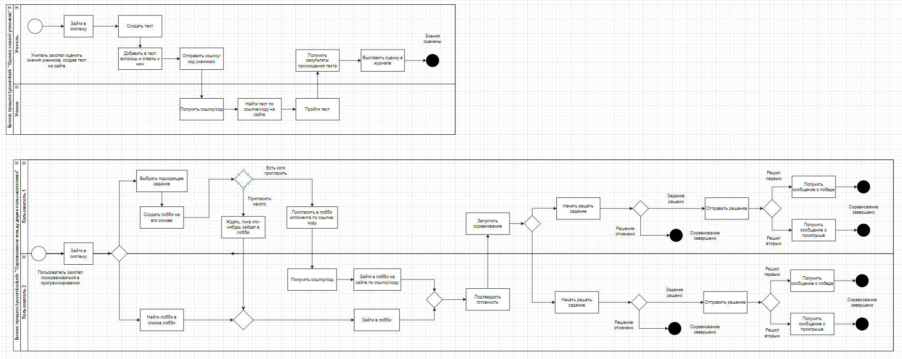

# Coduelists

# Состав команды

**Рыжик Даниил**, **Цыганов Владислав**, **Кочиев Сергей**, **Черных Егор**, **Киселёв Артём**, **Белов Степан**, **Канашин Дмитрий**

# Содержание
- [Введение](#введение)
    - [Цель проекта](#цель-проекта)
    - [О проекте](#о-проекте)
    - [Причины возникновения проекта](#причины-возникновения-проекта)
    - [Задумка/Идея](#задумкаидея)
    - [Какие проблемы решает проект](#какие-проблемы-решает-проект)
- [Базовый функционал](#базовый-функционал)
    - [Диаграммы вариантов использования](#диаграммы-вариантов-использования)
    - [Диаграммы бизнес процессов](#диаграммы-бизнес-процессов)
- [Стейкхолдеры и их интересы](#стейкхолдеры-и-их-интересы)
- [Риски реализации](#риски-реализации)
- [План поэтапной разработки и расширения системы](#план-поэтапной-разработки-и-расширения-системы)
- [Критические бизнес-сценарии](#критические-бизнес-сценарии)
- [Атрибуты качества](#атрибуты-качества)
- [Нефункциональные требования](#нефункциональные-требования)
- [Используемые ресурсы](#используемые-ресурсы)

# Введение

### Цель проекта

Создание платформы для учителей, учеников и студентов-программистов.

### О проекте

***Tycoon*** - это приложение разделенное на два подприложения.

1. ***Tasks.Tycoon***. Это базовое приложение, которое обеспечивает функционал, связанный с процессом проверки знаний учеников школ и университетов посредством тестовых заданий и заданий, где необходим развёрнутый ответ.
2. ***Coduels.Tycoon***. Это приложение, которое обеспечивает функционал, связанный с решения задач по программированию в сорвнователной форме между двумя пользователями. Главной задачей пользователя является решить задание раньше чем это сделает оппонент.

### Причины возникновения проекта
Наш проект начался с просьбы школьного преподавателя создать систему для тестирования учеников, чтобы отслеживать их уровень подготовки к ЕГЭ по информатике. Позже, общаясь с другими преподавателями, мы обнаружили, что многие из них не используют подобные сервисы по разным причинам: сложный интерфейс, платные тарифы и другие. Так и родился проект под названием ***Tycoon***.

Идея для ***Coduels*** родилась во время очередной сессии в компьютерной игре. Мы чувствовали себя виноватыми за то, что тратим время в играх, поэтому решили, что было бы здорово играть и программировать одновременно. Так зародилась концепция сервиса, где программисты соревнуются в решении программистских задач на скорость в формате 1 на 1.

Поскольку обе эти идеи связаны с образованием и решением задач, мы решили объединить их в одно приложение, которое собираемся представить.

### Задумка/Идея

Прежде всего - создать удобную платформу для проверки знаний или тестирования учеников. Ею смогут использовать учителя школ, ВУЗов и частные преподаватели. Назначение сервиса зависит от целей пользователя. Это может быть удобное проведение контрольной работы, опросник, или систематическая проверка домашних заданий.

Вторая часть сервиса - соревновательная платформа, где ученики могут на скорость решать задачи по программированию. Данный формат решения задач дает мотивацию к обучению 
двумя путями. 1 - желание играть с друзьями, 2 - желание побить существующие рекорды
### Какие проблемы решает проект
Проблему обучения учеников и студентов, их тестирования, получения информации об уровне их знаний и обучение программированию в игровой форме.

# Базовый функционал

### Диаграммы вариантов использования:

Источник: [Google Drive](https://drive.google.com/file/d/1m8xbO5F63d_SYwYb3J5pwmLKoa3dfRzW/view)

### Диаграммы бизнес процессов

Источник: [Google Drive](https://drive.google.com/file/d/1zhpiWUTrlhhsmi75ZiMnB_fpCJlJtU9J/view)

# Стейкхолдеры и их интересы

# Риски реализации

# План поэтапной разработки и расширения системы

# Критические бизнес-сценарии

# Атрибуты качества

# Нефункциональные требования

# Используемые ресурсы

Макет: [Pixso](https://pixso.net/app/editor/9SNHoKLOuor0Dc9HEo2RGA?icon_type=1&page-id=53%3A56)
