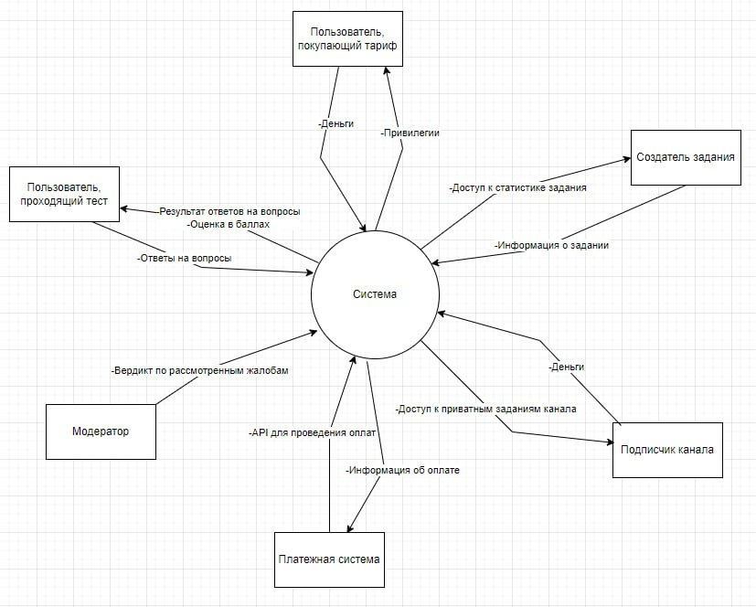

# Coduelists

# 7 Итерация
https://docs.google.com/presentation/d/1HvGnNoPaQ3qJMIiVB8_l-6tvqpsS8MhXZ_Y9PFRQ5Ho/edit#slide=id.g2bf117ea868_0_75

# Состав команды

**Рыжик Даниил**, **Цыганов Владислав**, **Кочиев Сергей**, **Черных Егор**, **Киселёв Артём**, **Белов Степан**, **Канашин Дмитрий**

# Содержание
- [Введение](#введение)
    - [О проекте](#о-проекте)
    - [Цель проекта](#цель-проекта)
    - [Причины возникновения проекта](#причины-возникновения-проекта)
    - [Какие проблемы решает проект](#какие-проблемы-решает-проект)
- [Глоссарий](#глоссарий)
- [MVP](#mvp)
- [Контекстная диаграмма](#контекстная-диаграмма)
- [Диаграмма вариантов использования](#диаграмма-вариантов-использования)
- [Архитектурный шаблон](#архитектурный-шаблон)
- [Внешние системы](#внешние-системы)
- [Стейкхолдеры, их интересы и ответственности](#стейкхолдеры-их-интересы-и-ответственности)
- [Функциональные требования](#функциональные-требования)
- [Структура данных](#структура-данных)
- [Автоматизируемые процессы](#автоматизируемые-процессы)
- [Конкурентный анализ](#конкурентный-анализ)
- [Риски реализации](#риски-реализации)
- [План поэтапной разработки и расширения системы](#план-поэтапной-разработки-и-расширения-системы)
- [Требования атрибутов качества](#требования-атрибутов-качества)
- [Используемые ресурсы](#используемые-ресурсы)

# Введение

### О проекте

***Tasks.Tycoon***. Наше веб-приложение обеспечивает функционал, связанный с процессом тестирования пользователей с помощью заданий.

### Цель проекта
Создание веб-приложения, где можно создавать, выполнять авто проверяемые задания и получать по ним статистику.

### Назначение
Облегчение процесса тестирования посредством автоматизации проверки ответов учеников и сбора статистики по созданным заданиям, что освобождает создателя от множественной ручной проверки работ и сбора их статистики выполнения.

### Причины возникновения проекта
Наш проект начался с просьбы школьного преподавателя создать систему для тестирования учеников, чтобы отслеживать их уровень подготовки к ЕГЭ по информатике. Позже, общаясь с другими преподавателями, мы обнаружили, что многие из них не используют подобные сервисы по разным причинам: сложный интерфейс, платные тарифы и другие. Так и родился проект под названием ***Task.Tycoon***.

### Какие проблемы решает проект
Проблему автоматизации процесса тестирования, сбора статистики по заданиям.

# Глоссарий

- Задание: создается пользователем с соответствующим тарифом. Состоит из вопросов.
- Вопрос: составная часть Задания может быть одним из 4 типов.
- Канал - группа в которой создатель имеет возможность публиковать задания для своих подписчиков.
- Лента рекомендаций - страница с рекомендациями, выводящая контент в зависимости от интересов пользователя. Она разделена на страницы двух видов: Лента заданий и Лента каналов.
- Лента заданий - отображает задания, которые могут быть интересны пользователю (интерес основывается на истории просмотра)
- Лента каналов - отображает каналы, которые могут быть интересны пользователю (интерес основывается на истории просмотра)
- Модератор: пользователь, имеющий права модератора. Следит за соблюдением правил платформы и обрабатывает жалобы и запросы пользователей.
- Мои задания - страница, которая есть у любого пользователя. на этой вкладке появляются новые задания из всех каналов, на которые он подписался.
- Подписка - возможность получить доступ к приватным заданиям канала на платной основе.
- Пользователь: посетитель сайта.
- Профиль: страница, на которой хранится информация о пользователе.
- Создатель - пользователь, который создал канал
- Тариф: привилегии аккаунта пользователя, приобретаемые на платной основе. В них могут входить: большее кол-во создаваемых заданий, каналов, количество вопросов в заданиях.
- Подписчик - пользователь, который подписался на канал.
- ДЗ - страница, которая есть у любого пользователя. на этой вкладке появляются новые задания из всех каналов, на которые он подписался.
- Рейтинг - средняя оценка задания. Оценить задание можно после его выполнения (пятибалльная шкала).
- Заявки - страница, которая доступна учителю. Там появляются заявки, которые оставили пользователи для подписки на канал. Он может их отклонить или принять.
- Избранное - страница, которая доступна любому пользователю. в ней хранятся все задания которые были отмечены пользователем как “избранное”.

# MVP
- Регистрация и авторизация: Пользователи должны иметь возможность зарегистрироваться и авторизоваться на платформе..
- Личный кабинет: Пользователи должны иметь доступ к личному кабинету, где они могут просматривать свои результаты, настраивать профиль и создавать и редактировать задания.
- Создание заданий: Пользователи должны иметь возможность создавать здания различных типов (тестовые задания, задания с нескольколькими ответами и задания с развернутым ответом).
- Прохождение заданий: Пользователи должны иметь возможность проходить задания, созданные другими пользователями.
- Проверка ответов: Платформа должна автоматически проверять ответы на тестовые задания и задания с нескольколькими ответами
- Результаты: Пользователи должны иметь возможность видеть результаты своих заданий на которые они ответили

# Контекстная диаграмма

1. С кем взаимодействует система?
    - Пользователи проходящие тесты
      Пользователь предоставляет свои ответы и тест, на который он ответил. Система возвращает ему результат ответов, посчитанную оценку в баллах
    - Пользователи покупающие тариф
      Пользователь предоставляет определенную сумму, система дает ему соответствующие привилегии
    - Пользователи-создатели задания
      Пользователь предоставляет название задания, его вопросы с ответами. Система создает его и дает доступ к статистике выполнения задания.
    - Пользователи-подписчики каналов
      Пользователь предоставляет определенную сумму. Система дает доступ к платным заданиям канала.
    - Пользователи-модераторы
      Пользователь предоставляет системе результат рассмотрения жалоб/вопросов. Система реагирует на них и принимает соответствующие меры.
    - Платежная система
      Система заимствует у платежной системы API для совершения онлайн-покупок (оформление тарифа, подписка на канал)
2. Автоматизированные процессы
    - Процесс проверки вопросов
    - Процесс подсчета оценки за задания
    - Процесс автоматизации уведомления
    - Процесс формирования персональных рекомендаций заданий
    - Процесс продления подписки
    - Процесс формирования статистики
3. Контекстная диаграмма

# Диаграмма вариантов использования
https://drive.google.com/file/d/1VIucrObQF_OBukRxdnSEftkdgNRIhLM7/view

# Архитектурный шаблон
Для нашего проекта мы выбрали многослойную архитектуру. Она хорошо подходит для web-приложений и проста в реализации. Ее суть заключается разделение системы на слои(представления, бизнес-логики, доступа к данным, безопасности и др.)
1. Обоснование выбора многослойной архитектуры:
- Простота реализации:
Многослойная архитектура хорошо подходит для начинающих команд как мы, так как ее концепция легко понимается и реализуется.
Это позволит нам быстрее начать разработку проекта и уменьшить риски, связанные с выбором более сложных архитектурных стилей.
- Модульность:
Разделение системы на слои обеспечивает высокую модульность, что упрощает разработку, тестирование и сопровождение кода.
Каждый слой может быть разработан и протестирован независимо, что делает код более понятным и управляемым.
- Масштабируемость:
Многослойная архитектура легко масштабируется путем добавления новых слоев или серверов.
Это позволит нам без труда увеличивать производительность и функциональность вашего приложения по мере роста его популярности.
Соответствие требованиям:
Многослойная архитектура хорошо подходит для реализации веб-приложений с различными функциональными и нефункциональными требованиями.
Она может быть адаптирована для обеспечения безопасности, производительности и других важных характеристик.
2. Оценка недостатков:
- Снижение производительности:
Снижение производительности на 5-10% будет незначительным для нашего небольшого веб-приложения.
Однако важно будет провести тщательную оптимизацию и тестирование, чтобы убедиться, что производительность остается на приемлемом уровне.
- Сложность управления зависимостями:
В нашем проекте будет небольшое количество зависимостей, следовательно это убирает недостаток связанный со сложностью управления зависимостями.
Однако важно тщательно планировать архитектуру и использовать инструменты управления зависимостями, чтобы избежать проблем в будущем.
Также в связке с модульной архитектурой будем использовать компонентно-ориентированную архитектуру:
- Соответствие многослойной архитектуре:
Компонентно-ориентированная архитектура хорошо сочетается с многослойной архитектурой.
Она позволяет разделять слои на более мелкие компоненты, что further improves модульность и управляемость кода.
- Дополнительные преимущества:
Повторное использование компонентов: Компоненты могут быть повторно использованы в разных слоях и приложениях, что экономит время и ресурсы.
- Расширяемость: Новые компоненты могут быть легко добавлены в систему без необходимости рефакторинга существующего кода.
Перед началом разработки будет проведено тщательное проектирование, необходимо тщательно продумать архитектуру каждого слоя и компонента.
Это поможет избежать проблем с производительностью, зависимостями и другими аспектами разработки.
Существует множество инструментов и библиотек, которые могут упростить разработку и управление многослойной архитектурой.

Начнем с самой верхушки айсберга и будем постепенно углубляться. Разделение frontend и backend на 2 различных слоя/сервиса уже считается проявлением многослойной архитектуры. 
Почему мы решили их разделить, а не стали писать одни монолитный сервис? 
Большие монолитные репозитории создают три проблемы — сильное зацепление, ненужную коммуникацию и сложный деплой.
- Сильное зацепление: В больших монолитных репозиториях различные компоненты часто сильно связаны между собой. Это означает, что изменения в одной части кода могут иметь непредсказуемые последствия для других частей системы.
- Ненужная коммуникация: В больших монолитных сервисах для координации работы различных команд могут требоваться частые коммуникации и согласования. Это может приводить к ненужной коммуникации и потере времени на обсуждение деталей, которые не имеют прямого отношения к работе конкретной команды. Это снижает эффективность разработчиков
- Сложный деплой: При наличии множества компонентов в монолитном репозитории развертывание системы может быть сложным и подверженным ошибкам. Необходимость разворачивать и обновлять все компоненты одновременно может увеличить риск возникновения проблем при деплое. Это замедлить процесс доставки новых функций и увеличить время простоя системы

Теперь перейдем к тому, как во frontend’e и backend’e будет организована многослойную архитектуру.
Frontend часть будет построена вокруг фреймворка Nextjs. Из-за того что это фреймворк, он имеет свою архитектуру. И к нашему счастью она уже является многослойной. Вот несколько доказательств этого:
- Структура проекта: Next.js рекомендует определенную структуру проекта, которая подразумевает разделение кода на различные слои. Это включает в себя разделение компонентов, страниц, API эндпоинтов и статических файлов.
- Компоненты и страницы: В Next.js компоненты могут быть организованы в различных слоях, таких как компоненты высшего порядка (HOC), контейнеры, компоненты представления и т. д. Это позволяет разделить логику, представление и управление состоянием для лучшей масштабируемости и поддерживаемости.
- Клиентская и серверная части: Next.js позволяет разделять код между клиентской и серверной частями приложения. Код, написанный в папке pages, может выполняться как на сервере (для серверного рендеринга), так и на клиенте (для интерактивности).
- API маршрутизация:: Next.js позволяет определять API маршруты внутри папки pages/api, что позволяет разделить серверную логику от фронтенд-кода. Это обеспечивает четкое разделение между клиентским и серверным кодом.
Использование различных пакетов и инструментов: Next.js также позволяет разработчикам возможность использовать различные пакеты и инструменты для создания многослойной архитектуры. Например, Redux или Zustand могут использоваться для управления состоянием, а Axios или Fetch API — для взаимодействия с сервером.
Также от frontend`a будет отделен слой с UI. Все элементыдизайна интерфейса будут вынесены в отдельную библиотеку(UI KIT), которая будет подключаться к основной части frontend’а.
Наше приложение будет в будущем расти, из-за чего было принято решение использовать FSD архитектуру(https://feature-sliced.design/ru/). Она поможет разбить части frontend’а. на еще более мелкие составляющие, чтобы упростить масштабируемость и поддерживаемость в будущем.

Backend также имплементирует многослойную архитектуру. Backend разрабатывается с помощью фреймворка Django, архитектура которого называется MVT (M-models, T-templates, V-views) Каждая часть архитектуры имеет свою роль и вот какую:
- Models - Часть архитектуры, которая отвечает за представление структуры базы данных. Она включает в себя поля таблиц, их связи и валидацию данных. Взаимодействие с моделями сделано с помощью ORM (Object relational mapping) Это технология программирования, которая позволяет связывать объекты программного кода с записями в реляционных базах данных. ОРМ упрощает взаимодействие с базами данных, позволяя разработчикам работать с объектами и методами, вместо написания прямых SQL-запросов. ОРМ также обеспечивает автоматическое создание SQL-запросов для выполнения операций CRUD
- Views - Представления. - Логика отработки Сервера по предоставлению данных при запросе к определенному адресу. Эта часть архитектуры включает в себя: маршрутизацию запросов, логическую обработку данных, Middleware.
- Templates - Шаблоны. Как правило - статическая часть сайта, которая включает в себя файлы html, js, css. Опционально отвечает за хранение и использование статических файлов наподобие фото, видео, иконки.

# Внешние системы

- Microsoft Excel
- Нейросеть FuzzyWuzzy
- Телеграм бот Task.Tycoon

# Стейкхолдеры, их интересы и ответственности

1. Дизайнеры:
    - Интересы: Создание удобного и привлекательного интерфейса для пользователей и администраторов.
    - Ответственности: Разработка прототипов, UI/UX дизайн, создание макетов и графических элементов.
2.	Backend-разработчики:
    - Интересы: обеспечить надежную, масштабируемую и функциональную серверную часть приложения.
    - Ответственности: Разработка API, работа с базами данных, логика приложения, серверная инфраструктура.
3.	Frontend-разработчики:
    - Интересы: Создание интерактивного и отзывчивого интерфейса для пользователей.
    - Ответственности: Разработка веб-интерфейса, работа с JavaScript, HTML, CSS, интеграция с API.
4.	Тестировщики:
    - Интересы: обеспечить качество и функциональность приложения.
    - Ответственности: проводить тестирование приложения, выявлять ошибки, предоставлять отчеты.
5.	Пользователи:
    - Интересы: получить удобный инструмент для прохождения тестов и получения результатов.
    - Ответственности: проходить тесты, предоставлять обратную связь о работе приложения.
6. Инвесторы:
    - Интересы: получение прибыли.
    - Ответственности: грамотное принятие решений, которые поспособствуют развитию проекта.
7. Модераторы:
    - Интересы: поддержание порядка и безопасности на платформе.
    - Ответственности: справедливое и беспристрастное отношение к пользователям.
8. Учителя:
    - Интересы: обеспечение качественного обучения, оценка знаний учеников, возможность получать прибыль с помощью монетизации.
    - Ответственности: предоставление качественного материала и объективная оценка знаний учеников.

# Функциональные требования

1. Регистрация пользователя(заполнение формы регистрации)
    - 1.1 Никнейм
    - 1.2 Почта
    - 1.3 Пароль
    - 1.4 Подтверждение пароля
2. Вход пользователя(заполнение формы входа)
    - 2.1 Почта
    - 2.2 Пароль
3. Профиль пользователя
    - 3.1 Редактирование профиля
        - 3.1.1 Никнейм
        - 3.1.2 Аватар
        - 3.1.3 Имя
        - 3.1.4 Фамилия
        - 3.1.5 Почта
        - 3.1.6 Доступность дополнительной информации
            - 3.1.6.1 Скрыта
            - 3.1.6.2 Не скрыта
        - 3.1.7 Пароль
    - 3.2 Просмотр своего профиля
	    - 3.2.1 Никнейм
	    - 3.2.2 Статус
        - 3.2.3 Аватар
        - 3.2.4 Имя
        - 3.2.5 Фамилия
        - 3.2.6 Почта
        - 3.2.7 Статистика
            - 3.2.7.1 Количество созданных заданий
            - 3.2.7.2 Количество пройденных заданий
        - 3.2.8 Созданные задания
        - 3.2.9 Пройденные задания
        - 3.2.10 Созданные каналы
        - 3.2.11 Дата регистрации аккаунта
    - 3.3 Просмотр чужого профиля
        - 3.3.1 Если у аккаунта скрыта доп. информация
		    - 3.3.1.1 Никнейм
		    - 3.3.1.2 Аватар
        - 3.3.2 Если у аккаунта не скрыта доп. информация
	        - 3.3.2.1 Никнейм
	        - 3.3.2.2 Аватар
		    - 3.3.2.3 Имя
		    - 3.3.2.4 Фамилия
		    - 3.3.2.5 Созданные задания
		    - 3.3.2.6 Созданные каналы
		    - 3.3.2.7 Дата регистрации аккаунта
		    - 3.3.2.8 Статистика
                - 3.3.2.8.1 Количество созданных заданий
			    - 3.3.2.8.2 Количество пройденных заданий
4. Взаимодействия с заданиями
    - 4.1 Создание задания (заполнение формы создания задания)
        - 4.1.1 Название
        - 4.1.2 Краткое описание
        - 4.1.3 Полное описание
        - 4.1.4 Настройки
            - 4.1.4.1 Отображать проходящему результат?
	        - 4.1.4.2 Количество попыток (10 макс)
	        - 4.1.4.3 Тип видимости
                - 4.1.4.3.1 Публичное
		        - 4.1.4.3.2 Приватное
		        - 4.1.4.3.3 Канал
                    - 4.1.4.3.1.1 Название канала
			        - 4.1.4.3.1.2 По подписке?
        - 4.1.5 Загрузка материалов (файлов)
        - 4.1.6 Вопросы
            - 4.1.6.1 Текст вопроса
	        - 4.1.6.2 Максимальное количество баллов за вопрос (целое число)
            - 4.1.6.3 Тип вопроса
                - 4.1.6.3.1 Тестовый вопрос с одним верным ответом
		        - 4.1.6.3.2 Тестовый вопрос с несколькими верными ответами
		        - 4.1.6.3.3 Вопрос с развернутым ответом и автоматической - проверкой
		        - 4.1.6.3.4 Вопрос с развернутым ответом без - автоматической проверки
            - 4.1.6.4 Ответы на вопрос
                - 4.1.6.4.1 Если тип вопроса - “тестовый с одним верным ответом”, то создать нужное кол-во ответов, у каждого указать текст ответа и выбрать из них только один верный.
		        - 4.1.6.4.2 Если тип вопроса - “тестовый с несколькими верными вариантами ответа”, то создать нужное кол-во ответов, у каждого указать текст ответа и выбрать из них минимум один верных.
		        - 4.1.6.4.3 Если тип вопроса: “с развернутым ответом и автоматической проверкой”,  то указать текст ответа
		        - 4.1.6.4.4 Если тип вопроса: “с развернутым ответом без автоматической проверки”, то нельзя указать ответ
    - 4.2 Редактирование задания(к редактированию задания входят изменение всех параметров которые у заказаны в пункте 4.1)
    - 4.3 Удаление задания
    - 4.4 Просмотр статистики задания
        - 4.4.1 Самый проблемный вопрос
	    - 4.4.2 Ответы всех учеников
            - 4.4.2.1 Ответ одного ученика
                - 4.4.2.1.1 Количество попыток
			    - 4.4.2.1.2 Ответы
			    - 4.4.2.1.3 Результаты ответов
			    - 4.4.2.1.4 Результирующий балл
			    - 4.4.2.1.5 Процент верного выполнения
        - 4.4.3  Генерация отчета в формате excel файла, дублирующего статистику.
    - 4.5 Решение заданий
        - 4.5.1 Ответ на вопросы
            - 4.5.1.1 Если тип вопроса - “тестовый с одним верным ответом”, то выбрать один вариант ответа.
	        - 4.5.1.2 Если тип вопроса - “тестовый с несколькими верными вариантами ответа”, то выбрать минимум один вариант ответа.
	        - 4.5.1.3 Если тип вопроса: “с развернутым ответом и автоматической проверкой”,  то написать ответ вручную
	        - 4.5.1.4 Если тип вопроса: “с развернутым ответом без автоматической проверки”, то написать ответ вручную
        - 4.5.2 Оценка задания
5. Взаимодействие с каналом
    - 5.1 Создание канала (заполнение формы создания канала)
        - 5.1.1 Название
	    - 5.1.2 Краткое описание
	    - 5.1.3 Полное описание
	    - 5.1.4 Рекомендовать в ленте?
	    - 5.1.5 Тип входа
            - 5.1.5.1 Свободный
		    - 5.1.5.2 По запросу
        - 5.1.6 Цена подписки
            - 5.1.6.1 Сумма
		    - 5.1.6.2 Бесплатно
   -  5.2 Редактирование канала(к редактированию канала входят изменение всех параметров которые у заказаны в пункте 5.1)
    - 5.3 Удаление канала
    - 5.4 Просмотр статистики канала
        - 5.4.1 Название
	    - 5.4.2 Количество пользователей
	    - 5.4.3 Количество заданий
6. Сертификация пользователя
    - 6.1 Оставить заявку на сертификацию аккаунта
7. Просмотр ленты рекомендаций
    - 7.1 Просмотр ленты рекомендуемых заданий
    - 7.2 Просмотр ленты рекомендуемых каналов
8. Поисковая система
    - 8.1 Заданий
    - 8.2 Каналов
9. Покупка платного контента
    - 9.1 Оформление платной подписки на канал
    - 9.2 Покупка тарифа для расширения возможностей аккаунта
10. Раздел поддержки
    - 10.1 FAQ, возможность указать неточность/ошибку, возможность предложить улучшение проекта, задать вопрос.
11. Безопасность
    - 11.1 Хранение персональных и чувствительных данных в закрытом контуре
    - 11.2  Шифрование/маскирование при передаче и использовании данных. В т.ч. шифрование с асимметричными ключами или хэширование с использованием динамической соли.
    - 11.3 DDOS защита
    - 11.4 Подсистема мониторинга
        - 11.4.1 RED метод сбора метрик (rate - количество запросов в сек, errors- количество ошибок (при интеграции между системами, системных, пользовательских), duration- время запроса)
        - 11.4.2 Бизнес метрики (кол-во заданий, кол-во каналов, кол-во новых пользователей, общее кол-во пользователей, количество продаж)
    - 11.5 Администратор контента(отзывов, каналов, заданий)
	    - 11.5.1 Сотрудники, реагирующий на жалобы
		    - 11.5.1.1 Неподходящий контент (жалобы на контент, который нарушает правила проекта, нормы приличия, некачественный материал, ложные сведения)
		    - 11.5.1.2 Нарушение авторских прав (жалобы на контент, который нарушает авторские права, такие как плагиат или незаконное использование чужого контента без разрешения)
		    - 11.5.1.3 Технические неполадки

# Структура данных

- Задание:
	- Название (строка, макс длина - 127)
	- Создатель (ключ, таблица Пользователь)
	- Краткое описание (строка,  макс длина - 255)
	- Полное описание (текст, необязательное поле)
	- Настройки
		- Отображать проходящему результат? (булин, значение по умолчанию - ДА)
		- Количество попыток (число, по умолчанию - 1)
		- Тип видимости (поле с выбором, по умолчанию - публичное, выбор среди:)
			- Публичное
			- Приватное
			- Канал
    - Канал (ключ, таблица Канал)
	- Материалы (файл, максимальный вес файла - 20 Мб)
	- Слаг (слаг, по умолчанию - транслитерация названия и цифры)
	- Дата создания (дата, по умолчанию - момент создания задания)
	- Идентификатор (число, по умолчанию - случайное уникальное число, макс длина - 7)

- Вопрос:
	- Задание (ключ, таблица Задание)
	- Текст (строка, макс длина - 255)
	- Максимальное количество баллов за вопрос (число, по умолчанию - 1)
	- Тип (поле с выбором, по умолчанию - с развернутым ответом и автоматической проверкой, выбор среди:)
		- тестовый с одним верным ответом
		- тестовый с несколькими верными вариантами ответа
		- с развернутым ответом и автоматической проверкой
		- с развернутым ответом без автоматической проверки
	- Контент (JSON)

- Пользователь
	- Никнейм (строка, макс длина - 127)
	- Почта (строка, макс длина - 63)
	- Пароль (строка, мин длина - 8, макс длина - 31)

- Профиль
	- Пользователь (ключ, таблица Пользователь)
	- Имя (строка, макс длина 31, необязательное)
	- Фамилия (строка, макс длина 31, необязательное)
	- Аватар (строка, по умолчанию - путь до default изображения)
	- Показывать дополнительную информацию? (булин, по умолчанию - ДА)
	- Тариф (строка, по умолчанию - базовый)
	- Дата регистрации (дата, по умолчанию - момент создания)

- Ответ
	- Контент (JSON)
	- Пользователь (ключ, таблица Пользователь)
	- Вопрос (ключ, таблица Вопрос)

- Канал
    - Создатель
    - Участник
    - Стоимость

# Автоматизируемые процессы

- Автоматическая проверка вопросов, кроме тех, чей тип “вопрос с развернутым ответом без автоматической проверки”
- Автоматический подсчет оценки за задание
- Автоматическая отправка уведомлений о появлении новых заданий от преподавателя или канала, а также оповещение пользователя за несколько дней до окончания подписки.
- Автоматическая персональная рекомендация заданий
- Автоматическое продление подписки при согласии
- Автоматическое формирование статистики профиля, каналов, заданий.

# Конкурентный анализ

|                                                       | Coduels  | Stepik       | Google Forms      | SkySmart |
|-------------------------------------------------------|:--------:|:------------:|:-----------------:|:--------:|
| Сертификация                                          |    +     |       +      |         -         |     +    |
| Свободный доступ к публикации контента             |    +     |       -      |         +         |     -    |
| Объективный рейтинг                                   |    +     |       +      |         -         |     -    |
| Лента рекомендаций, основаннаяна предпочтениях     |    +     |       +      |         -         |     -    |
| Весь базовый функционал бесплатный                 |    +     |       -      |         +         |     -    |
| Гибкая настройка видимой в профиле информации      |    +     |       -      |         -         |     -    |
| Неограниченное количество каналов для одного автора|    +     |       -      |         +         |     -    |
| Автоматическая проверка и валидация ответов        |    +     |       +      |         +         |     +    |
| Индивидуальный подход                                 |    +     |       +      |         -         |     +    |

# Риски реализации

1. **Безопасность данных**:
    - С увеличением количества пользователей и их активности на сайте, увеличивается риск столкнуться с утечкой личной информации, несанкционированным доступом к аккаунтам пользователей или атаками на сервер
2. **Некачественный контент**:
    - Пользователи могут выкладывать нежелательный контент (спам; контент, нарушающий авторские права; неправильные задания; незаконные материалы).
3. **Отсутствие интереса пользователей**:
    - Низкая активность или недостаточное количество контента. Это может произойти из-за недостаточной рекламы или большой конкуренции.
4. **Неэффективная модерация**:
    - Большое количества контента, который пользователи могут выкладывать, может привести к спаму или распространению вредоносного контента(некорректные задания), которые модерация не сможет контролировать
5. **Недостаточная монетизация**:
    - Недостаточная монетизация может привести к финансовым затруднениям или закрытию проекта
6. **Технические проблемы**:
    - Сайт может столкнуться со сбоем сервера, проблемами с производительностью, несовместимостью с различными браузерами или устройствами
7. **Юридические проблемы**:
    - Нарушение авторских прав, недостаточная защита потребителя (утечка личных данных пользователей) могут привести к штрафам или закрытию проекта.
8. **Нехватка обновлений и поддержки**:
    - Может привести к уязвимости безопасности, снижению производительности.
9. **Изменения в технологическом стеке**:
    - Технологии быстро меняются, следовательно нужно быть готовым к их внедрению

# План поэтапной разработки и расширения системы

# Макет

https://www.figma.com/file/e5DF4glQ8WyW4nWMnzhKiP/task2?type=design&node-id=32%3A453&mode=design&t=vkEFYCV6oL5G4o3s-1

https://www.figma.com/file/7K3Mg8BbqEdsu5FcMKNHa6/task?type=design&node-id=1%3A26&mode=design&t=O26I3WKh4HYC3T53-1

# Требования атрибутов качества

Стандарт ISO 9126-4

<table>
    <tbody>
        <tr>
            <td><b>Id</b></td>
            <td><b>Атрибут качества</b></td>
            <td><b>Общее измерение</b></td>
            <td><b>Внутренние измерения</b></td>
        </tr>
        <tr>
            <td>QA1</td>
            <td>Функциональность</td>
            <td>4</td>
            <td>
                <table style="width: 100%;">
                    <tbody>
                        <tr>
                            <td>Полнота</td>
                            <td>5</td>
                        </tr>
                        <tr>
                            <td>Точность</td>
                            <td>3</td>
                        </tr>
                        <tr>
                            <td>Совместимость</td>
                            <td>3</td>
                        </tr>
                        <tr>
                            <td>Безопасность</td>
                            <td>4</td>
                        </tr>
                    </tbody>
                </table>
            </td>
        </tr>
        <tr>
            <td>QA2</td>
            <td>Надежность</td>
            <td>3</td>
            <td>
                <table style="width: 100%;">
                    <tbody>
                        <tr>
                            <td>Зрелость</td>
                            <td>4</td>
                        </tr>
                        <tr>
                            <td>Отказоустойчивость</td>
                            <td>2</td>
                        </tr>
                        <tr>
                            <td>Восстанавливаемость</td>
                            <td>3</td>
                        </tr>
                    </tbody>
                </table>
            </td>
        </tr>
        <tr>
            <td>QA3</td>
            <td>Юзабилити</td>
            <td>5</td>
            <td>
                <table style="width: 100%;">
                    <tbody>
                        <tr>
                            <td>Понятность</td>
                            <td>5</td>
                        </tr>
                        <tr>
                            <td>Обучаемость</td>
                            <td>5</td>
                        </tr>
                        <tr>
                            <td>Эффективность использования</td>
                            <td>4</td>
                        </tr>
                        <tr>
                            <td>Привлекательность</td>
                            <td>5</td>
                        </tr>
                    </tbody>
                </table>
            </td>
        </tr>
        <tr>
            <td>QA4</td>
            <td>Эффективность</td>
            <td>1</td>
            <td>
                <table style="width: 100%;">
                    <tbody>
                        <tr>
                            <td>Поведение во времени</td>
                            <td>1</td>
                        </tr>
                        <tr>
                            <td>Утилизация ресурсов</td>
                            <td>1</td>
                        </tr>
                    </tbody>
                </table>
            </td>
        </tr>
        <tr>
            <td>QA5</td>
            <td>Ремонтопригодность</td>
            <td>1</td>
            <td>
                <table style="width: 100%;">
                    <tbody>
                        <tr>
                            <td>Анализируемость</td>
                            <td>1</td>
                        </tr>
                        <tr>
                            <td>Изменчивость</td>
                            <td>1</td>
                        </tr>
                        <tr>
                            <td>Стабильность</td>
                            <td>2</td>
                        </tr>
                        <tr>
                            <td>Тестируемость</td>
                            <td>1</td>
                        </tr>
                    </tbody>
                </table>
            </td>
        </tr>
        <tr>
            <td>QA6</td>
            <td>Переносимость</td>
            <td>4</td>
            <td>
                <table style="width: 100%;">
                    <tbody>
                        <tr>
                            <td>Адаптивность</td>
                            <td>4</td>
                        </tr>
                        <tr>
                            <td>Возможность установки</td>
                            <td>5</td>
                        </tr>
                        <tr>
                            <td>Сосуществование</td>
                            <td>2</td>
                        </tr>
                    </tbody>
                </table>
            </td>
        </tr>
    </tbody>
</table>

# BackEnd Разработка

Физическая модель данных

Админ панель

# Дизайн

Демо сайта https://tasknew-blush.vercel.app/

# Используемые ресурсы

Используемые ресурсы:

[Архитектура клиентского приложения]([https://habr.com/ru/companies/larian/articles/329032/])

[GigaChat]([https://developers.sber.ru/gigachat])
