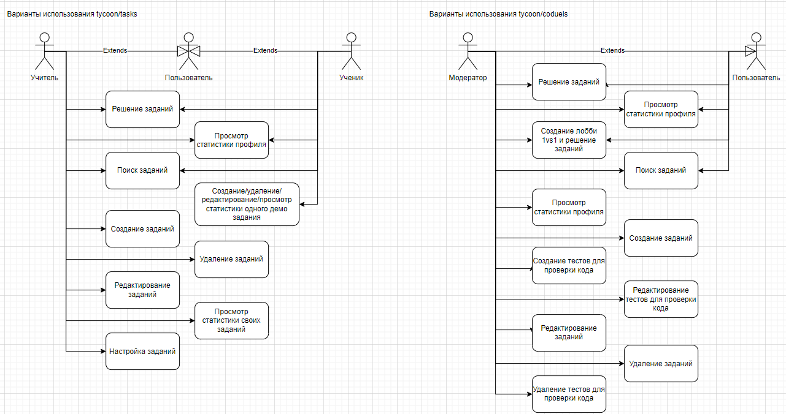

# Coduelists

## Наша команда

**Рыжик Даниил**, **Цыганов Владислав**, **Кочиев Сергей**, **Черных Егор**, **Киселёв Артём**, **Белов Степан**, **Канашин Дмитрий**

# 1. Введение

## Цель проекта

Создание платформы для учителей, учеников и студентов-программистов.

## О проекте
***Tycoon*** - это приложение разделенное на два подприложения.

1. ***Tasks.Tycoon***. Это базовое приложение, которое обеспечивает функционал, связанный с процессом проверки знаний учеников школ и университетов посредством тестовых заданий и заданий, где необходим развёрнутый ответ.
2. ***Coduels.Tycoon***. Это приложение, которое обеспечивает функционал, связанный с решения задач по программированию в сорвнователной форме между двумя пользователями. Главной задачей пользователя является решить задание раньше чем это сделает оппонент.

## Причины возникновения проекта
Наш проект начался с просьбы школьного преподавателя создать систему для тестирования учеников, чтобы отслеживать их уровень подготовки к ЕГЭ по информатике. Позже, общаясь с другими преподавателями, мы обнаружили, что многие из них не используют подобные сервисы по разным причинам: сложный интерфейс, платные тарифы и другие. Так и родился проект под названием ***Tycoon***.

Идея для ***Coduels*** родилась во время очередной сессии в компьютерной игре. Мы чувствовали себя виноватыми за то, что тратим время в играх, поэтому решили, что было бы здорово играть и программировать одновременно. Так зародилась концепция сервиса, где программисты соревнуются в решении программистских задач на скорость в формате 1 на 1.

Поскольку обе эти идеи связаны с образованием и решением задач, мы решили объединить их в одно приложение, которое собираемся представить.

## Какие проблемы решает проект
Проблему обучения учеников и студентов, их тестирования, получения информации об уровне их знаний и обучение программированию в игровой форме.

# 2. Базовый функционал

## Диаграммы вариантов использования:

Источник: https://drive.google.com/file/d/1m8xbO5F63d_SYwYb3J5pwmLKoa3dfRzW/view

# 3. Используемые ресурсы

Макет: https://pixso.net/app/editor/9SNHoKLOuor0Dc9HEo2RGA?icon_type=1&page-id=53%3A56
