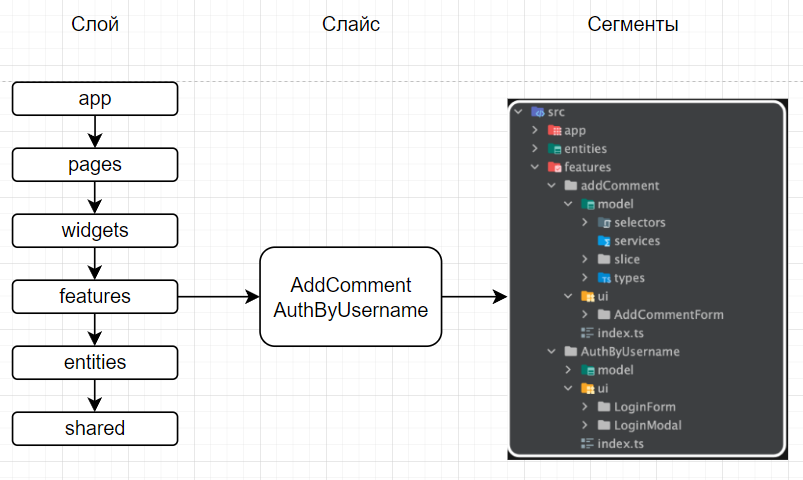

# Coduelists

# 8 Итерация

https://docs.google.com/presentation/d/1HvGnNoPaQ3qJMIiVB8_l-6tvqpsS8MhXZ_Y9PFRQ5Ho/edit#slide=id.g2bf117ea868_0_75

# Состав команды

**Рыжик Даниил**, **Цыганов Владислав**, **Кочиев Сергей**, **Черных Егор**, **Киселёв Артём**, **Белов Степан**, **Канашин Дмитрий**

# Содержание

- [Coduelists](#coduelists)
- [7 Итерация](#7-итерация)
- [Состав команды](#состав-команды)
- [Содержание](#содержание)
- [Введение](#введение)
  - [О проекте](#о-проекте)
  - [Цель проекта](#цель-проекта)
  - [Назначение](#назначение)
  - [Причины возникновения проекта](#причины-возникновения-проекта)
  - [Какие проблемы решает проект](#какие-проблемы-решает-проект)
- [Глоссарий](#глоссарий)
- [MVP](#mvp)
- [Контекстная диаграмма](#контекстная-диаграмма)
- [Диаграммы вариантов использования](#диаграммы-вариантов-использования)
    - [Задания и каналы](#задания-и-каналы)
    - [Профили и аккаунты](#профили-и-аккаунты)
    - [Администрирование](#администрирование)
    - [Платежи](#платежи)
    - [Авторизация](#авторизация)
- [Архитектурный шаблон](#архитектурный-шаблон)
- [Имплементация архитектуры.](#имплементация-архитектуры)
  - [Backend](#backend)
  - [Frontend](#frontend)
- [Внешние системы](#внешние-системы)
- [Стейкхолдеры, их интересы и ответственности](#стейкхолдеры-их-интересы-и-ответственности)
- [Функциональные требования](#функциональные-требования)
- [Структура данных](#структура-данных)
- [Структура API](#структура-api)
- [Автоматизируемые процессы](#автоматизируемые-процессы)
- [Конкурентный анализ](#конкурентный-анализ)
- [Риски реализации](#риски-реализации)
- [План поэтапной разработки и расширения системы](#план-поэтапной-разработки-и-расширения-системы)
- [Макет](#макет)
- [Требования атрибутов качества](#требования-атрибутов-качества)
- [Ограничения и подтверждения](#ограничения-и-подтверждения)
- [Декомпозиция вариантов использования](#декомпозиция-вариантов-использования)
  - [Принятие или отклонение запроса в канал](#принятие-или-отклонение-запроса-в-канал)
  - [Добавление вопроса к заданию](#добавление-вопроса-к-заданию)
  - [Добавление задания к каналу](#добавление-задания-к-каналу)
  - [Изменение пароля](#изменение-пароля)
  - [Создание задания/канала](#моздание-задания/канала)
  - [Удаление профиля (аккаунта)](#удаление-профиля-(аккаунта))
  - [Удаление задания/канала](#удаление-задания/канала)
  - [Изменение данных задания/канала/профиля](#изменение-данных-задания/канала/профиля)
  - [Добавление задания в избранное](#добавление-задания-в-избранное)
  - [Получение статистики задания](#получение-статистики-задания)
  - [Вход или подача запроса на вход в канал](#вход-или-подача-запроса-на-вход-в-канал)
  - [Вход в систему](#вход-в-систему)
  - [Удаление задания из канала](#удаление-задания-из-канала)
  - [Удаление участника из канала](#удаление-участника-из-канала)
  - [Поиск заданий/каналов/профилей](#поиск-заданий/каналов/профилей)
  - [Регистрация](#регистрация)
  - [Подписка на профиль](#подписка-на-профиль)
- [Дизайн](#дизайн)
- [Используемые ресурсы](#используемые-ресурсы)

# Введение

### О проекте

**_Tasks.Tycoon_**. Наше веб-приложение обеспечивает функционал, связанный с процессом тестирования пользователей с помощью заданий.

### Цель проекта

Создание веб-приложения, где можно создавать, выполнять авто проверяемые задания и получать по ним статистику.

### Назначение

Облегчение процесса тестирования посредством автоматизации проверки ответов учеников и сбора статистики по созданным заданиям, что освобождает создателя от множественной ручной проверки работ и сбора их статистики выполнения.

### Причины возникновения проекта

Наш проект начался с просьбы школьного преподавателя создать систему для тестирования учеников, чтобы отслеживать их уровень подготовки к ЕГЭ по информатике. Позже, общаясь с другими преподавателями, мы обнаружили, что многие из них не используют подобные сервисы по разным причинам: сложный интерфейс, платные тарифы и другие. Так и родился проект под названием **_Task.Tycoon_**.

### Какие проблемы решает проект

Проблему автоматизации процесса тестирования, сбора статистики по заданиям.

# Глоссарий

- Задание: создается пользователем с соответствующим тарифом. Состоит из вопросов.
- Вопрос: составная часть Задания может быть одним из 4 типов.
- Канал - группа в которой создатель имеет возможность публиковать задания для своих подписчиков.
- Лента рекомендаций - страница с рекомендациями, выводящая контент в зависимости от интересов пользователя. Она разделена на страницы двух видов: Лента заданий и Лента каналов.
- Лента заданий - отображает задания, которые могут быть интересны пользователю (интерес основывается на истории просмотра)
- Лента каналов - отображает каналы, которые могут быть интересны пользователю (интерес основывается на истории просмотра)
- Модератор: пользователь, имеющий права модератора. Следит за соблюдением правил платформы и обрабатывает жалобы и запросы пользователей.
- Мои задания - страница, которая есть у любого пользователя. на этой вкладке появляются новые задания из всех каналов, на которые он подписался.
- Подписка - возможность получить доступ к приватным заданиям канала на платной основе.
- Пользователь: посетитель сайта.
- Профиль: страница, на которой хранится информация о пользователе.
- Создатель - пользователь, который создал канал
- Тариф: привилегии аккаунта пользователя, приобретаемые на платной основе. В них могут входить: большее кол-во создаваемых заданий, каналов, количество вопросов в заданиях.
- Подписчик - пользователь, который подписался на канал.
- ДЗ - страница, которая есть у любого пользователя. на этой вкладке появляются новые задания из всех каналов, на которые он подписался.
- Рейтинг - средняя оценка задания. Оценить задание можно после его выполнения (пятибалльная шкала).
- Заявки - страница, которая доступна учителю. Там появляются заявки, которые оставили пользователи для подписки на канал. Он может их отклонить или принять.
- Избранное - страница, которая доступна любому пользователю. в ней хранятся все задания которые были отмечены пользователем как “избранное”.

# MVP

- Регистрация и авторизация: Пользователи должны иметь возможность зарегистрироваться и авторизоваться на платформе..
- Личный кабинет: Пользователи должны иметь доступ к личному кабинету, где они могут просматривать свои результаты, настраивать профиль и создавать и редактировать задания.
- Создание заданий: Пользователи должны иметь возможность создавать здания различных типов (тестовые задания, задания с нескольколькими ответами и задания с развернутым ответом).
- Прохождение заданий: Пользователи должны иметь возможность проходить задания, созданные другими пользователями.
- Проверка ответов: Платформа должна автоматически проверять ответы на тестовые задания и задания с нескольколькими ответами
- Результаты: Пользователи должны иметь возможность видеть результаты своих заданий на которые они ответили

# Контекстная диаграмма

1. С кем взаимодействует система?
   - Пользователи проходящие тесты
     Пользователь предоставляет свои ответы и тест, на который он ответил. Система возвращает ему результат ответов, посчитанную оценку в баллах
   - Пользователи покупающие тариф
     Пользователь предоставляет определенную сумму, система дает ему соответствующие привилегии
   - Пользователи-создатели задания
     Пользователь предоставляет название задания, его вопросы с ответами. Система создает его и дает доступ к статистике выполнения задания.
   - Пользователи-подписчики каналов
     Пользователь предоставляет определенную сумму. Система дает доступ к платным заданиям канала.
   - Пользователи-модераторы
     Пользователь предоставляет системе результат рассмотрения жалоб/вопросов. Система реагирует на них и принимает соответствующие меры.
   - Платежная система
     Система заимствует у платежной системы API для совершения онлайн-покупок (оформление тарифа, подписка на канал)
2. Автоматизированные процессы
   - Процесс проверки вопросов
   - Процесс подсчета оценки за задания
   - Процесс автоматизации уведомления
   - Процесс формирования персональных рекомендаций заданий
   - Процесс продления подписки
   - Процесс формирования статистики
3. Контекстная диаграмма

# Диаграммы вариантов использования

### Задания и каналы

### Профили и аккаунты

### Администрирование

### Платежи

### Авторизация

# Архитектурный шаблон

Для нашего проекта мы выбрали многослойную архитектуру. Она хорошо подходит для web-приложений и проста в реализации. Ее суть заключается разделение системы на слои(представления, бизнес-логики, доступа к данным, безопасности и др.)

1. Обоснование выбора многослойной архитектуры:

- Простота реализации:
  Многослойная архитектура хорошо подходит для начинающих команд как мы, так как ее концепция легко понимается и реализуется.
  Это позволит нам быстрее начать разработку проекта и уменьшить риски, связанные с выбором более сложных архитектурных стилей.
- Модульность:
  Разделение системы на слои обеспечивает высокую модульность, что упрощает разработку, тестирование и сопровождение кода.
  Каждый слой может быть разработан и протестирован независимо, что делает код более понятным и управляемым.
- Масштабируемость:
  Многослойная архитектура легко масштабируется путем добавления новых слоев или серверов.
  Это позволит нам без труда увеличивать производительность и функциональность вашего приложения по мере роста его популярности.
  Соответствие требованиям:
  Многослойная архитектура хорошо подходит для реализации веб-приложений с различными функциональными и нефункциональными требованиями.
  Она может быть адаптирована для обеспечения безопасности, производительности и других важных характеристик.

2. Оценка недостатков:

- Снижение производительности:
  Снижение производительности на 5-10% будет незначительным для нашего небольшого веб-приложения.
  Однако важно будет провести тщательную оптимизацию и тестирование, чтобы убедиться, что производительность остается на приемлемом уровне.
- Сложность управления зависимостями:
  В нашем проекте будет небольшое количество зависимостей, следовательно это убирает недостаток связанный со сложностью управления зависимостями.
  Однако важно тщательно планировать архитектуру и использовать инструменты управления зависимостями, чтобы избежать проблем в будущем.
  Также в связке с модульной архитектурой будем использовать компонентно-ориентированную архитектуру:
- Соответствие многослойной архитектуре:
  Компонентно-ориентированная архитектура хорошо сочетается с многослойной архитектурой.
  Она позволяет разделять слои на более мелкие компоненты, что further improves модульность и управляемость кода.
- Дополнительные преимущества:
  Повторное использование компонентов: Компоненты могут быть повторно использованы в разных слоях и приложениях, что экономит время и ресурсы.
- Расширяемость: Новые компоненты могут быть легко добавлены в систему без необходимости рефакторинга существующего кода.
  Перед началом разработки будет проведено тщательное проектирование, необходимо тщательно продумать архитектуру каждого слоя и компонента.
  Это поможет избежать проблем с производительностью, зависимостями и другими аспектами разработки.
  Существует множество инструментов и библиотек, которые могут упростить разработку и управление многослойной архитектурой.

# Имплементация архитектуры.

### Backend
Общая структура Backend

В общей структуре используется многослойная архитектура. Структура состоит из 4 слоев.
- Middlewares
- Controller
- Provider
- Database

**Midlewares** Среди мидлвейров используется пока что только один - JWT Interceptor, его роль - проверять наличие JWT Tokena (статуса авторизации отправителя) еще до прихода запроса в маршрутизатор. Исходя из этого он добавляет к запросу служебную информацию, которая содержит данные сессии пользователя, если он авторизован.
**Controller** Определяет конечную цель запроса. Перенаправляет запрос в необходимое приложение.
Все запросы с припиской “auth” он направляет в приложение authorization
Все запросы, связанные с questions, variants, tasks, search tasks e.t.c отправляет в приложение tasks
Все запросы с припиской “profiles” он направляет в приложение profiles
Все запросы с припиской payment направляет в приложение payment
**Provider** представляет из себя микросервисную архитектуру, состоящую из 4 микросервисов
- **Authorization** Содержит в себе функционал связанный с регистрацией пользователя и входом в аккаунт. Сервис состоит из Модели Пользователя и функций-представлений, которые взаимодействуют с моделью и совершают валидацию данных
- **Tasks** Самый крупный сервис. Состоит из моделей Задания, Вопроса, Варианта ответа, Подписки, Заявки на подписку, Ответа и функциями-представлениями, которые взаимодействуют с моделями и совершают валидацию и обработку данных
- **Profiles** Состоит из модели профиля и функций-представлений, которые взаимодействуют с моделью и совершают валидацию и обработку данных
- **Payment** Сервис, состоящий из функций-взаимодействия с внешней системой оплаты и функии-возврата сгенерированной на оплату ссылки
**Database** представляет из себя базу данных (и ее реплики), в которой хранятся модели

### Frontend

Frontend-часть будет построена с помощью многослойной архитектуры на основе фреймворка Nextjs и библиотеки React. Более подробный стек будет описан ниже.
Многослойную архитектуру можно назвать монолитной – это иерархическая архитектура, т.е. каждый слой приложения отвечает за свою часть функционала, например: работа с базой, логирование, интерфейс. Одним из представителей такой архитектуры является Feature-Sliced Design (https://feature-sliced.design/ru/docs/get-started/overview). Она была выбрана так как в будущем для проекта важно хорошая масштабируемости. В планах активно развивать данных проект и добавлять в него новые фичи Слои в Featured-sliced design группируются так, чтобы сделать поток данных в приложении линейным и однонаправленным. Это позволяет избежать неявных связей между модулями.

1. **Структура Featured-sliced Design**

Семь слоев делят код по зонам ответственности. Они строго стандартизированы во всех проектах: в любой команде каждый слой будет отвечать за одно и то же.
Весь код проекта распределяется между слоями по принципу: чем выше слой, тем сильнее он привязан к предметной области конкретного приложения. Нижний слой наиболее абстрактный.
В каждом слое находятся слайсы. Они разделяют код по предметной области, к которой относится та или иная функция. Это облегчает поиск нужного элемента в проекте.
В слайсах находятся сегменты, которые делят код по техническому назначению. Один из них — Public API, который нужен для импорта других сегментов наружу. То есть, мы можем инкапсулировать логику внутри слайса. Чаще всего встречаются:

- ui — визуальное представление
- model — бизнес-логика
- lib — утилиты, хуки, функции-помощники
- constants - константы
- types - типы данных используемые в данном слайсе
- api — работа с API

2. **Какие бывают слои и зачем они нужны?**

- Shared — слой для абстрактного, переиспользуемого кода. Это могут быть иконки, отображение кнопок, вспомогательные функции и утилиты, которые неоднократно применяются в разных местах приложения.
  Важное отличие слоя Shared от остальных: в нём нет слайсов. Он состоит из сегментов, которые мы можем многократно переиспользовать во всем приложении.
  Пример слоя shared:

- Entities — слой для конкретных бизнес-сущностей. Например, для приложения социальной сети это будут: статья, комментарий, страна.
  Пример слоя entities.

- Features — слой для элементов кода, которые определяют, как пользователь взаимодействует с бизнес-логикой. Это различные кнопки, выпадающие меню, селекты и всё остальное, что несёт бизнесовую логику и с чем можно взаимодействовать. Одна фича должна выполнять одну задачу.

- Widgets — опциональный слой, который связывает сущности и фичи. Он помогает собрать готовый смысловой блок из разных элементов. Виджеты позволяют расширять функциональность сущности.

- Pages — также композиционный слой. Он нужен, чтобы собирать из виджетов, сущностей и фичей полноценные страницы приложения. Главное правило для страниц — они должны быть максимально «тонкими», не содержать дополнительную бизнес-логику.

- App — это самый верхний, инициализирующий слой. Он содержит корневой компонент, глобальные типы, стили, стейт и оборачивает приложение в провайдеры и контексты — то, что присуще проекту в общем.

3. **Как будет реализован Data Layer (Слой данных).**

Данный слой отвечает за взаимодействие с сервером и сторонним API. Реализовано это взаимодействие может быть в сегменте “api” слоя, в котором нам нужны данные с бекенда. Data Layer отвечает за определение методов для выполнения HTTPS-запросов и создание моделей данных для удобной работы с полученной информацией.

Почему HTTPS-запросы, а не HTTP? HTTPS является расширением протокола HTTP с использованием шифрования TLS (Transport Layer Security). Он безопаснее, оптимизированней и вызывает больше доверия у пользователей.

В качестве инструментов для обращения к серверу или стороннему API и управления состояниями будет использоваться React Query (https://tanstack.com/query/latest/docs/framework/react/overview). Его преимущество перед Axios и Fetch в том, что он она позволяет легко получать, обновлять состояние сервера, автоматически кэшировать, синхронизировать данные.

В проекте будет использоваться REST API в качестве основного способа взаимодействия между клиентским приложением и сервером. REST API прост, гибок и имеет широкую поддержку.

Модель REST запроса:

4. **Как будет реализован Infrastructure Layer (Слой инфраструктуры)**

Управление роутингом контролируется фреймворком Nextjs. Pages Router - это маршрутизатор, основанный на файловой системе и построенный на концепции страниц.
Когда файл добавляется в каталог страниц, он автоматически становится доступным в качестве маршрута.

В Next.js страница - это React-компонент, экспортированный из файла .js, .jsx, .ts или .tsx в каталоге pages. Каждая страница связана с маршрутом на основе имени ее файла.

Пример: Если вы создадите страницу pages/about.js, экспортирующую React-компонент, как показано ниже, она будет доступна по адресу /about.

Для улучшения читабельности кода и избежания ошибок будет использоваться prettier, eslint и husky.

# Внешние системы

- Microsoft Excel
- Нейросеть FuzzyWuzzy
- Телеграм бот Task.Tycoon

# Стейкхолдеры, их интересы и ответственности

1. Дизайнеры:
   - Интересы: Создание удобного и привлекательного интерфейса для пользователей и администраторов.
   - Ответственности: Разработка прототипов, UI/UX дизайн, создание макетов и графических элементов.
2. Backend-разработчики:
   - Интересы: обеспечить надежную, масштабируемую и функциональную серверную часть приложения.
   - Ответственности: Разработка API, работа с базами данных, логика приложения, серверная инфраструктура.
3. Frontend-разработчики:
   - Интересы: Создание интерактивного и отзывчивого интерфейса для пользователей.
   - Ответственности: Разработка веб-интерфейса, работа с JavaScript, HTML, CSS, интеграция с API.
4. Тестировщики:
   - Интересы: обеспечить качество и функциональность приложения.
   - Ответственности: проводить тестирование приложения, выявлять ошибки, предоставлять отчеты.
5. Пользователи:
   - Интересы: получить удобный инструмент для прохождения тестов и получения результатов.
   - Ответственности: проходить тесты, предоставлять обратную связь о работе приложения.
6. Инвесторы:
   - Интересы: получение прибыли.
   - Ответственности: грамотное принятие решений, которые поспособствуют развитию проекта.
7. Модераторы:
   - Интересы: поддержание порядка и безопасности на платформе.
   - Ответственности: справедливое и беспристрастное отношение к пользователям.
8. Учителя:
   - Интересы: обеспечение качественного обучения, оценка знаний учеников, возможность получать прибыль с помощью монетизации.
   - Ответственности: предоставление качественного материала и объективная оценка знаний учеников.

# Функциональные требования

https://drive.google.com/file/d/1ko9Z7CKhoknuoLTJwGjIgNsicjryRcfb/view?usp=sharing

# Структура данных

# Структура API

# Автоматизируемые процессы

- Автоматическая проверка вопросов, кроме тех, чей тип “вопрос с развернутым ответом без автоматической проверки”
- Автоматический подсчет оценки за задание
- Автоматическая отправка уведомлений о появлении новых заданий от преподавателя или канала, а также оповещение пользователя за несколько дней до окончания подписки.
- Автоматическая персональная рекомендация заданий
- Автоматическое продление подписки при согласии
- Автоматическое формирование статистики профиля, каналов, заданий.

# Конкурентный анализ

|                                                        | Coduels | Stepik | Google Forms | SkySmart |
| ------------------------------------------------------ | :-----: | :----: | :----------: | :------: |
| Сертификация                                           |    +    |   +    |      -       |    +     |
| Свободный доступ к публикации контента              |    +    |   -    |      +       |    -     |
| Объективный рейтинг                                    |    +    |   +    |      -       |    -     |
| Лента рекомендаций, основаннаяна предпочтениях      |    +    |   +    |      -       |    -     |
| Весь базовый функционал бесплатный                  |    +    |   -    |      +       |    -     |
| Гибкая настройка видимой в профиле информации       |    +    |   -    |      -       |    -     |
| Неограниченное количество каналов для одного автора |    +    |   -    |      +       |    -     |
| Автоматическая проверка и валидация ответов         |    +    |   +    |      +       |    +     |
| Индивидуальный подход                                  |    +    |   +    |      -       |    +     |

# Риски реализации

1. **Безопасность данных**:
   - С увеличением количества пользователей и их активности на сайте, увеличивается риск столкнуться с утечкой личной информации, несанкционированным доступом к аккаунтам пользователей или атаками на сервер
2. **Некачественный контент**:
   - Пользователи могут выкладывать нежелательный контент (спам; контент, нарушающий авторские права; неправильные задания; незаконные материалы).
3. **Отсутствие интереса пользователей**:
   - Низкая активность или недостаточное количество контента. Это может произойти из-за недостаточной рекламы или большой конкуренции.
4. **Неэффективная модерация**:
   - Большое количества контента, который пользователи могут выкладывать, может привести к спаму или распространению вредоносного контента(некорректные задания), которые модерация не сможет контролировать
5. **Недостаточная монетизация**:
   - Недостаточная монетизация может привести к финансовым затруднениям или закрытию проекта
6. **Технические проблемы**:
   - Сайт может столкнуться со сбоем сервера, проблемами с производительностью, несовместимостью с различными браузерами или устройствами
7. **Юридические проблемы**:
   - Нарушение авторских прав, недостаточная защита потребителя (утечка личных данных пользователей) могут привести к штрафам или закрытию проекта.
8. **Нехватка обновлений и поддержки**:
   - Может привести к уязвимости безопасности, снижению производительности.
9. **Изменения в технологическом стеке**:
   - Технологии быстро меняются, следовательно нужно быть готовым к их внедрению

# План поэтапной разработки и расширения системы

# Макет

https://www.figma.com/file/e5DF4glQ8WyW4nWMnzhKiP/task2?type=design&node-id=32%3A453&mode=design&t=vkEFYCV6oL5G4o3s-1

https://www.figma.com/file/7K3Mg8BbqEdsu5FcMKNHa6/task?type=design&node-id=1%3A26&mode=design&t=O26I3WKh4HYC3T53-1

# Требования атрибутов качества

Стандарт ISO 9126-4

<table>
    <tbody>
        <tr>
            <td><b>Id</b></td>
            <td><b>Атрибут качества</b></td>
            <td><b>Общее измерение</b></td>
            <td><b>Внутренние измерения</b></td>
        </tr>
        <tr>
            <td>QA1</td>
            <td>Функциональность</td>
            <td>4</td>
            <td>
                <table style="width: 100%;">
                    <tbody>
                        <tr>
                            <td>Полнота</td>
                            <td>5</td>
                        </tr>
                        <tr>
                            <td>Точность</td>
                            <td>3</td>
                        </tr>
                        <tr>
                            <td>Совместимость</td>
                            <td>3</td>
                        </tr>
                        <tr>
                            <td>Безопасность</td>
                            <td>4</td>
                        </tr>
                    </tbody>
                </table>
            </td>
        </tr>
        <tr>
            <td>QA2</td>
            <td>Надежность</td>
            <td>3</td>
            <td>
                <table style="width: 100%;">
                    <tbody>
                        <tr>
                            <td>Зрелость</td>
                            <td>4</td>
                        </tr>
                        <tr>
                            <td>Отказоустойчивость</td>
                            <td>2</td>
                        </tr>
                        <tr>
                            <td>Восстанавливаемость</td>
                            <td>3</td>
                        </tr>
                    </tbody>
                </table>
            </td>
        </tr>
        <tr>
            <td>QA3</td>
            <td>Юзабилити</td>
            <td>5</td>
            <td>
                <table style="width: 100%;">
                    <tbody>
                        <tr>
                            <td>Понятность</td>
                            <td>5</td>
                        </tr>
                        <tr>
                            <td>Обучаемость</td>
                            <td>5</td>
                        </tr>
                        <tr>
                            <td>Эффективность использования</td>
                            <td>4</td>
                        </tr>
                        <tr>
                            <td>Привлекательность</td>
                            <td>5</td>
                        </tr>
                    </tbody>
                </table>
            </td>
        </tr>
        <tr>
            <td>QA4</td>
            <td>Эффективность</td>
            <td>1</td>
            <td>
                <table style="width: 100%;">
                    <tbody>
                        <tr>
                            <td>Поведение во времени</td>
                            <td>1</td>
                        </tr>
                        <tr>
                            <td>Утилизация ресурсов</td>
                            <td>1</td>
                        </tr>
                    </tbody>
                </table>
            </td>
        </tr>
        <tr>
            <td>QA5</td>
            <td>Ремонтопригодность</td>
            <td>1</td>
            <td>
                <table style="width: 100%;">
                    <tbody>
                        <tr>
                            <td>Анализируемость</td>
                            <td>1</td>
                        </tr>
                        <tr>
                            <td>Изменчивость</td>
                            <td>1</td>
                        </tr>
                        <tr>
                            <td>Стабильность</td>
                            <td>2</td>
                        </tr>
                        <tr>
                            <td>Тестируемость</td>
                            <td>1</td>
                        </tr>
                    </tbody>
                </table>
            </td>
        </tr>
        <tr>
            <td>QA6</td>
            <td>Переносимость</td>
            <td>4</td>
            <td>
                <table style="width: 100%;">
                    <tbody>
                        <tr>
                            <td>Адаптивность</td>
                            <td>4</td>
                        </tr>
                        <tr>
                            <td>Возможность установки</td>
                            <td>5</td>
                        </tr>
                        <tr>
                            <td>Сосуществование</td>
                            <td>2</td>
                        </tr>
                    </tbody>
                </table>
            </td>
        </tr>
    </tbody>
</table>

# Ограничения и подтверждения

Проектирование информационной системы для детей требует особого внимания к безопасности, конфиденциальности и удобству использования. Вот несколько ограничений и подтверждений, которые можно ввести:

1. Ограничение доступа к личной информации: Детям не должно быть разрешено предоставлять личные данные без согласия родителей или опекунов. Это означает, что система должна быть настроена таким образом, чтобы ограничить доступ к такой информации или требовать подтверждение от взрослых.
2. Ограничение доступа к нежелательному контенту: Система должна иметь фильтры и механизмы контроля, чтобы предотвратить доступ детей к нежелательному или нецензурному контенту. Это включает в себя контроль доступа к сторонним ресурсам и мониторинг контента, предоставляемого пользователями.
3. Контроль доступа к коммуникациям: Поскольку в системе предусмотрена возможность общения между пользователями, необходимо иметь механизмы контроля, чтобы предотвратить нецензурные или вредоносные сообщения, а также обеспечить безопасную обстановку для общения.
4. Механизмы безопасности: Для защиты от нежелательных действий или злоумышленных атак следует внедрить механизмы безопасности, такие как проверка подлинности, шифрование данных и мониторинг активности пользователей.
5. Обучение безопасности в интернете: Система может предоставлять ресурсы и обучающие материалы по безопасности в интернете, чтобы помочь детям и их родителям развивать навыки цифровой грамотности и осознанного использования онлайн-ресурсов.

# Декомпозиция вариантов использования

## Принятие или отклонение запроса в канал

## Добавление вопроса к заданию

## Добавление задания к каналу

## Изменение пароля

## Создание задания/канала

## Удаление профиля (аккаунта)

## Удаление задания/канала

## Изменение данных задания/канала/профиля

## Добавление задания в избранное

## Получение статистики задания

## Вход или подача запроса на вход в канал

## Вход в систему

## Удаление задания из канала

## Удаление участника из канала

## Поиск заданий/каналов/профилей

## Регистрация

## Подписка на профиль

# Дизайн

Демо сайта https://tasknew-blush.vercel.app/

# Используемые ресурсы

Используемые ресурсы:

[Архитектура клиентского приложения]([https://habr.com/ru/companies/larian/articles/329032/])

[GigaChat]([https://developers.sber.ru/gigachat])
